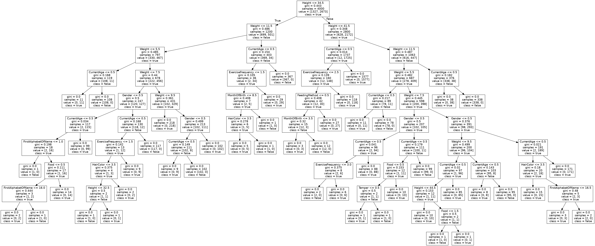
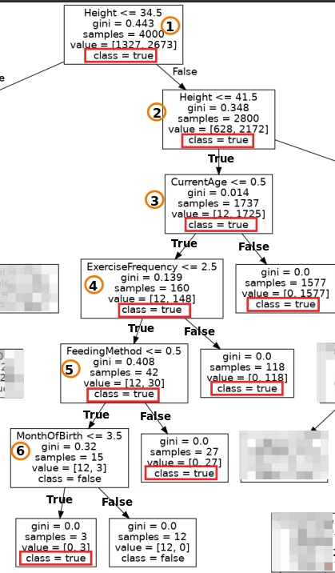

# Data Mining Hw2 Report

:girl: P77111037 樊紹萱

## :one: 檔案結構與開發環境

1. tool: Pipenv
2. python version: python 3.8

   ```txt=
   [[source]]
   url = "https://pypi.org/simple"
   verify_ssl = true
   name = "pypi"

   [packages]
   pandas = "==1.2.0"
   numpy = "==1.23.4"
   tensorflow = "==2.10.0"
   sklearn = "*"
   scikit-learn = "*"
   matplotlib = "*"

   [dev-packages]

   [requires]
   python_version = "3.8"
   ```

## :two: Data Design

### :bulb: Problem Definition: 決定柴犬是否可以超過10歲？

- 利用以下 11 種特徵和 5 個規則，來判定柴柴是否能活超過十歲
- file: `genrerate_data.py`

### :star: Feature

1. Current age: 0 ~ 9
2. Weight (kg): 5~15
3. Height (cm): 30 ~ 45
4. Gender: `F` or `M`
5. Month of birth: 1 ~ 12
6. Hair Color: `yellow` or `black` or `white` or `black and tan`
7. Food: `feed` or `can` or `fresh`
8. Feeding Method: `stocking` or `indoor` or `indoor and yard`
9. Temper: `good` or `bad`
10. Exercise frequency per week: 1~7
11. First alphabet of name: A ~ Z

[Reference](https://zh.wikipedia.org/zh-tw/%E6%9F%B4%E7%8A%AC)

### :star: Rule

:memo: 若滿足以下**五個規則之一**，則判定該柴柴會活超過10歲

1. If current age >= 1:
   - Female: weight :point_right: 6 ~ 9
   - Male: weight :point_right: 8 ~ 11
2. If current age >= 1:
   - Height: 35 ~ 41
3. Month of birth (If is Fibonacci): 1,2,3,5,8
4. Feeding Method: `indoor` or `indoor and yard`
5. Exercise frequency per week: 3~7

## :three: Classification Models

1. Decision Tree:
   - file: `decision_tree.py`
2. Any models of your preference :point_right: KNN:
   - file: `knn.py`

## :four: Report

### :evergreen_tree: Decision Trees



### :evergreen_tree: Comparisons

Compare your absolutely right rules with the rules generated by the classification model(s).

#### Compare (以最終類別是 :o:  的情況來說)



| Index | DecisionTreeClassifier() rules  | My rules|
| ----- | ------------------------------- | ------- |
| 1 | <span style="color:yellow">[class :point_right: True]</span> Height >=34.5 | :pushpin: If CurrentAge >= 1 **&** Height: 35 ~ 41 :point_right: True <br> :pencil2: 發現其實這邊蠻像的，決策樹的規則是 Height >=34.5 且 <=41.5 (可對比我的 Height 需介於 35 ~ 41) <br> :pencil2: 決策樹的規則是以 CurrentAge <=0.5 來做決策，而我是用 CurrentAge <=1 |
| 2 | <span style="color:yellow">[class :point_right: True]</span> Height <=41.5 | ^ 同上 |
| 3 | <span style="color:yellow">[class :point_right: True]</span> CurrentAge <=0.5 | ^ 同上 |
| 4 | <span style="color:yellow">[class :point_right: True]]</span> ExerciseFrequency <=2.5 | :pushpin: Exercise frequency per week: `3~7` :point_right: True  <br> :pencil2: 決策樹是以 ExerciseFrequency 2.5 來做分界，而我自訂的規則是 3。<br> :pencil2: 綜合上一個 CurrentAge ， 決策樹這邊若 CurrentAge <= 0.5 時，即使 ExerciseFrequency <= 2.5 ，則最後的結果還是判定為 True。因為我的規則裡沒有去限制 CurrentAge <1 的情況，所以是合裡的。|
| 5 | <span style="color:yellow">[class :point_right: True]]</span> FeedingMethod <=0.5| :pushpin: Feeding Method: `indoor` (對應到的值：1) or `indoor and yard` (對應到的值：2) <br> :pencil2: 決策樹是定義 >= 0.5 時則結果判斷為 True，可對應到我的規則，當 Feeding Method = 1 or 2 時會判定結果為 True  |
| 5 | <span style="color:yellow">[class :point_right: True]]</span> MonthOfBirth <=3.5| :pushpin: Month of birth (If is Fibonacci): 1,2,3,5,8 <br> :heavy_exclamation_mark: **決策樹是定義 <= 3.5** 時則結果判斷為 True，跟我的規則稍稍有衝突，因為**我是定義 MonthOfBirth in [1,2,3,5,8]** 時會判定結果為 True，我自己的想法是認為因為 3.5 差不多是等於 [1,2,3,5,8] 的平均，決策樹才會這樣子判斷的 |

### :evergreen_tree: :k: Discussion
